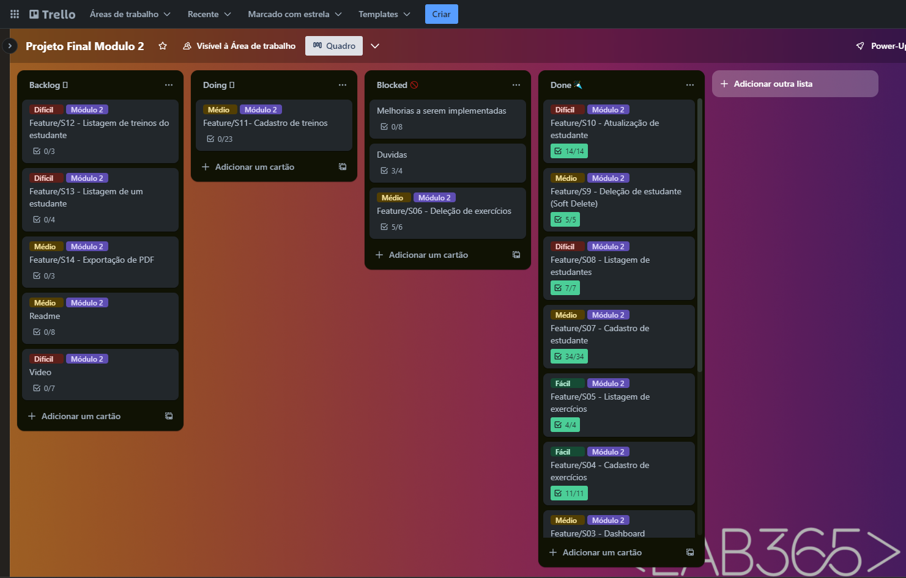
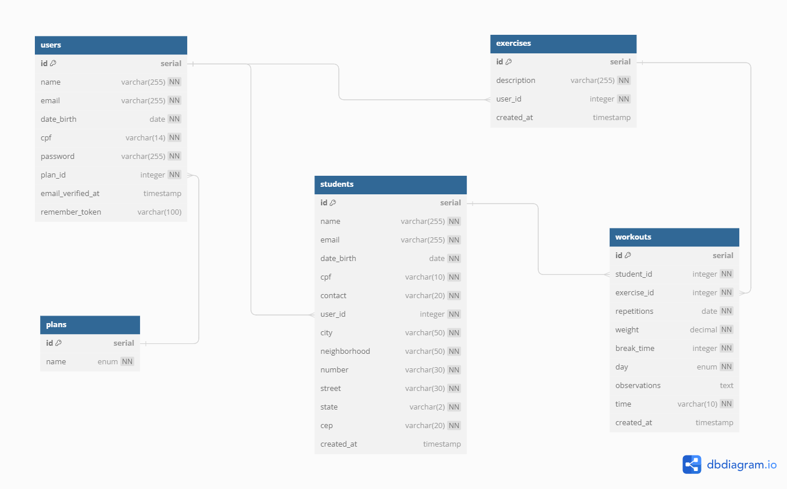
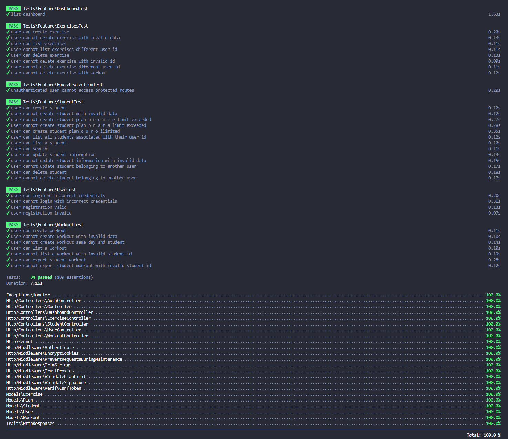

<p align=center>
    
</p>

# Introdução

O GO!FIT System agora conta com um back-end dedicado e robusto, desenvolvido em Laravel 10 e banco de dados PostgreSQL. A API REST resultante é uma solução prática para a administração eficiente de instrutores de academia, visando otimizar tarefas diárias, como gerenciamento de alunos, treinos e exercícios.

## Dependências do sistema

-   [PHP 8.1 ou superior](https://www.php.net/downloads)
-   [Composer 2.6.5 ou superior](https://getcomposer.org/download/)
-   [Docker](https://docs.docker.com/desktop/install/windows-install/)

## Tecnologias e técnicas utilizadas

Essa API REST completa foi desenvolvida utilizando:

-   **Linguagem:** PHP
-   **Framework:** Laravel 10
-   **Banco de Dados:** PostgreSQL
-   **Testes Unitários:** PHPUnit Laravel

## Metodologia de Desenvolvimento

O projeto foi conduzido sob a prática de [Trunk-based Development](https://www.optimizely.com/optimization-glossary/trunk-based-development), que oferece benefícios notáveis. Essa metodologia proporciona um fluxo de trabalho simples e direto, promovendo uma integração rápida e contínua com a branch principal. Essa abordagem ágil facilita iterações frequentes, detecção precoce de problemas e entregas contínuas, contribuindo para a eficiência e qualidade do desenvolvimento.

### Organização com Kanban no Trello

Além disso, adotou-se a a metodologia Kanban para organizar tarefas e cards no Trello, conforme ilustrado na imagem abaixo:

<p align=center>
    
</p>

A utilização do Kanban proporciona uma visão clara do fluxo de trabalho, permitindo uma gestão eficiente das tarefas, além colaboração eficaz, quando usado em equipes.

## Modelagem da base de dados PostgreSQL

Antes do início do projeto, foi elaborada a modelagem utilizando o [dbdiagram.io](https://dbdiagram.io/).

A documentação detalhada do modelo está disponível em [dbdocs.io/caroline_08022/GOFIT_System](https://dbdocs.io/caroline_08022/GOFIT_System), e uma versão simplificada pode ser visualizada na imagem abaixo:

<p align=center>
    
</p>

A imagem acima proporciona uma perspectiva geral da estrutura do banco de dados integrado ao sistema.

## IDE utilizada para o desenvolvimento

[VSCode](https://code.visualstudio.com/)

## Setup local

Para garantir a execução correta da API no ambiente local, siga as etapas:

### Clone o projeto

```bash
git clone https://github.com/CarolineSampaio/projeto-final-modulo2
cd projeto-final-modulo2
```

### Instale as dependências do projeto

```bash
composer install
```

##

### Crie o banco de dados usando docker

```bash
docker run --name academia -e POSTGRESQL_USERNAME=seu_usuario -e POSTGRESQL_PASSWORD=sua_senha -e POSTGRESQL_DATABASE=academia_api -p 5432:5432 bitnami postgresql
```

Substitua `seu_usuario` e `sua_senha` pelos dados desejados para acesso ao banco de dados.

##### A porta 5432 representa o mapeamento da porta padrão do PostgreSQL, porém, se necessário, poderá ser alterada.

#### Conecte com o dbeaver para visualizar os dados - opcional

No DBeaver, vá para "Nova Conexão", escolha "PostgreSQL", avance para a próxima aba e insira as credenciais conforme definido no comando anterior de criação do banco de dados. Teste a conexão e conclua o processo.

##

### Configure o ambiente

Na raiz do projeto, localize o arquivo .env.example, duplique-o e altere seu nome para .env, neste arquivo ficarão as credenciais do banco de dados e outras configurações sensíveis que não são compartilháveis.

Busque os parâmetros mencionados abaixo, e altere-os conforme seu ambiente local, e definições implementadas ao criar o banco de dados:

```bash
DB_CONNECTION=pgsql
DB_HOST=127.0.0.1  # Equivalente ao localhost, altere se necessário
DB_PORT=5432
DB_DATABASE=academia_api
DB_USERNAME= # Nome de usuário para acesso ao banco
DB_PASSWORD= # Senha de acesso ao banco
```

Além disso, é necessário configurar as credenciais relacionadas ao e-mail, para que quando um usuário se cadastre, seja enviado para a caixa correta no mailtrap.io:

```bash
MAIL_MAILER=smtp
MAIL_HOST=sandbox.smtp.mailtrap.io
MAIL_PORT= # Porta disponibilizada no mailtrap
MAIL_USERNAME= # Nome de usuário disponibilizado no mailtrap
MAIL_PASSWORD= # Senha disponibilizada no mailtrap
MAIL_ENCRYPTION=null
MAIL_FROM_ADDRESS="hello@example.com"
MAIL_FROM_NAME="${APP_NAME}"
```

### Execute a seed para popular o banco de dados

```sh
php artisan db:seed PopulatePlans
```

### Execute o comando para criar as migrações do banco de dados

```sh
php artisan migrate
```

### Inicialize o servidor

```sh
php artisan serve
```

## Executando os Testes Unitários

Para garantir a solidez e confiabilidade do sistema, foram desenvolvidos 34 testes unitários, com 100% de cobertura do código.

Certifique-se de seguir os passos abaixo para executar os testes com sucesso:

### Configurando o Ambiente de Testes com Docker para o PostgreSQL

Antes de executar os testes, é necessário criar um novo banco de dados exclusivo para testes. Utilize o seguinte comando Docker para criar um contêiner PostgreSQL:

##### Certifique-se de que a porta 5432 esteja disponível antes de executar o comando, evitando possíveis falhas na criação do banco de dados de teste.

```bash
docker run --name academia_test_db -e POSTGRESQL_USERNAME=seu_usuario -e POSTGRESQL_PASSWORD=sua_senha -e POSTGRESQL_DATABASE=academia_api_test -p 5432:5432 bitnami/postgresql
```

Substitua `seu_usuario` e `sua_senha` pelos dados desejados para acesso ao banco de dados.

### Execute o seguinte comando para rodar os testes

```bash
php artisan test
```

### Execute o seguinte comando para rodar os testes com relatório de cobertura de código

Para uma análise detalhada da cobertura de código, é necessário ter o suporte do Xdebug. Certifique-se de que o ambiente esteja corretamente configurado para uma avaliação completa da cobertura dos testes.

```bash
php artisan test --coverage
```

<p align=center>
    
</p>

Captura de tela do resultado esperado dos testes unitários.

## Documentação da API

### Endpoints - Rotas Usuário

#### S01 - Cadastro de usuário

Rota pública destinada ao cadastro de um novo usuário.

`POST /api/users`

| Parâmetro    | Tipo     | Descrição                                                                  |
| ------------ | -------- | -------------------------------------------------------------------------- |
| `name`       | `string` | **Máximo de 255 caracteres e obrigatório**.                                |
| `email`      | `string` | **Máximo de 255 caracteres, obrigatório, válido e único**.                 |
| `date_birth` | `date`   | **Máximo de 255 caracteres, obrigatório, válido e no formato yyyy-mm-dd**. |
| `cpf`        | `string` | **Máximo de 11 caracteres, obrigatório, válido e único**.                  |
| `password`   | `string` | **Máximo de 255 caracteres e obrigatório**.                                |
| `plan_id`    | `int`    | **Obrigatório**. Coluna chave estrangeira da tabela `plans`.               |

#### Exemplo de Request

Headers

```http
Accept: application/json
```

Request Body

```json
{
    "name": "Jane Doe",
    "email": "jane.doe@example.com",
    "date_birth": "1985-05-15",
    "cpf": "98765432101",
    "password": "securePass456",
    "plan_id": 2
}
```

Response

```json
{
    "message": "Usuário cadastrado com sucesso.",
    "status": 201,
    "data": {
        "name": "Jane Doe",
        "email": "jane.doe@example.com",
        "date_birth": "1985-05-15",
        "cpf": "98765432101",
        "plan_id": 2,
        "updated_at": "2023-12-29T04:12:00.000000Z",
        "created_at": "2023-12-29T04:12:00.000000Z",
        "id": 1,
        "plan": {
            "id": 2,
            "description": "PRATA",
            "limit": 20,
            "created_at": "2023-12-28T00:34:24.000000Z",
            "updated_at": "2023-12-28T00:34:24.000000Z"
        }
    }
}
```

| Response Status | Descrição                |
| --------------- | ------------------------ |
| `201`           | Criado com sucesso       |
| `400`           | Dados inválidos          |
| `500`           | Erro interno no servidor |

##

#### S02 - Login do usuário

Rota pública destinada ao serviço de login via e-mail e senha.

`POST /api/login`

| Parâmetro  | Tipo     | Descrição        |
| ---------- | -------- | ---------------- |
| `email`    | `string` | **Obrigatório**. |
| `password` | `string` | **Obrigatório**. |

#### Exemplo de Request

Headers

```http
Accept: application/json
```

Request Body

```json
{
    "email": "jane.doe@example.com",
    "password": "securePass456"
}
```

Response

```json
{
    "message": "Autenticação realizada com sucesso",
    "status": 200,
    "data": {
        "token": "1|Tx8srH8XxMGlOnzbFJTyrwxtt3osPk2FE47Mp7Gi0ca1ec9b",
        "name": "Jane Doe"
    }
}
```

| Response Status | Descrição                |
| --------------- | ------------------------ |
| `200`           | Ok - Sucesso             |
| `400`           | Dados inválidos          |
| `401`           | Credenciais inválidas    |
| `500`           | Erro interno no servidor |

##

#### S03 - Dashboard

Rota privada destinada listagem de dados do usuário autenticado para a o dashboard.

`GET /api/dashboard`

#### Exemplo de Request

Headers

```http
Accept: application/json
Auth: Bearer token
```

Response

```json
{
    "message": "",
    "status": 200,
    "data": {
        "registered_students": 0,
        "registered_exercises": 0,
        "current_user_plan": "Plano Prata",
        "remaining_students": 20
    }
}
```

| Response Status | Descrição                |
| --------------- | ------------------------ |
| `200`           | Ok - Sucesso             |
| `401`           | Não autenticado          |
| `500`           | Erro interno no servidor |

##

### Endpoints - Rotas Exercícios

#### S04 - Cadastro de exercícios

Rota privada destinada ao cadastro de exercícios.

`POST /api/exercises`

| Parâmetro     | Tipo     | Descrição                                   |
| ------------- | -------- | ------------------------------------------- |
| `description` | `string` | **Máximo de 255 caracteres e obrigatório**. |

#### Exemplo de Request

Headers

```http
Accept: application/json
Auth: Bearer token
```

Request Body

```json
{
    "description": "Cadeira Flexora"
}
```

Response

```json
{
    "message": "Exercício cadastrado com sucesso.",
    "status": 201,
    "data": {
        "description": "cadeira flexora",
        "id": 1
    }
}
```

| Response Status | Descrição                     |
| --------------- | ----------------------------- |
| `201`           | Criado com sucesso            |
| `400`           | Dados inválidos               |
| `401`           | Não autenticado               |
| `409`           | Conflito, exercício já existe |
| `500`           | Erro interno no servidor      |

##

#### S05 - Listagem de exercícios

Rota privada destinada a listagem de exercícios cadastrados pelo usuário autenticado.

`GET /api/exercises`

#### Exemplo de Request

Headers

```http
Accept: application/json
Auth: Bearer token
```

Response

```json
{
    "message": "Exercícios cadastrados por Jane Doe, listados com sucesso",
    "status": 200,
    "data": [
        {
            "id": 3,
            "description": "agachamento"
        },
        {
            "id": 1,
            "description": "cadeira flexora"
        },
        {
            "id": 2,
            "description": "supino"
        }
    ]
}
```

| Response Status | Descrição                |
| --------------- | ------------------------ |
| `200`           | Ok - Sucesso             |
| `401`           | Não autenticado          |
| `500`           | Erro interno no servidor |

##

#### S06 - Deleção de um exercício

Rota privada destinada a deleção de um exercício com base no id, que necessariamente deve ter sido criado pelo usuário autenticado.

`DELETE /api/exercises/:id`

| Parâmetro | Tipo  | Descrição                                                    |
| --------- | ----- | ------------------------------------------------------------ |
| `id`      | `int` | **Obrigatório e chave primária válida na tabela exercises**. |

#### Exemplo de Request:

```http
DELETE /api/exercises/1
```

Headers

```http
Accept: application/json
Auth: Bearer token
```

Response

```
Status 204 No Content
```

| Response Status | Descrição                    |
| --------------- | ---------------------------- |
| `204`           | Sem conteúdo (sucesso)       |
| `401`           | Não autenticado              |
| `403`           | Ação não permitida           |
| `404`           | Exercício não encontrado     |
| `409`           | Conflito por existir treinos |
| `500`           | Erro interno no servidor     |

##

### Endpoints - Rotas Estudante

#### S07 - Cadastro de estudante

Rota privada destinada ao cadastro de um estudante. O sucesso da requisição está condicionado ao limite do plano escolhido no cadastro em comparação a quantidade de estudantes já cadastrados no sistema, essa validação é feita através de um middleware.

`POST /api/students`

| Parâmetro      | Tipo     | Descrição                                                                  |
| -------------- | -------- | -------------------------------------------------------------------------- |
| `name`         | `string` | **Máximo de 255 caracteres e obrigatório**.                                |
| `email`        | `string` | **Máximo de 255 caracteres, obrigatório, válido e único**.                 |
| `date_birth`   | `string` | **Máximo de 255 caracteres, obrigatório, válido e no formato yyyy-mm-dd**. |
| `cpf`          | `string` | **Máximo de 11 caracteres, obrigatório, válido e único**.                  |
| `contact`      | `string` | **Máximo de 20 caracteres**.                                               |
| `cep`          | `string` | **Máximo de 20 caracteres**.                                               |
| `street`       | `string` | **Máximo de 30 caracteres**.                                               |
| `number`       | `string` | **Máximo de 30 caracteres**.                                               |
| `neighborhood` | `string` | **Máximo de 50 caracteres**.                                               |
| `city`         | `string` | **Máximo de 50 caracteres**.                                               |
| `state`        | `string` | **Máximo de 2 caracteres**.                                                |

#### Exemplo de Request

Headers

```http
Accept: application/json
Auth: Bearer token
```

Request Body

```json
{
    "name": "John Doe",
    "email": "john.doe@example.com",
    "date_birth": "1990-01-15",
    "cpf": "12345678909",
    "contact": "1198765-4321",
    "cep": "01234567",
    "street": "Avenida Paulista",
    "state": "SP",
    "neighborhood": "Bela Vista",
    "city": "São Paulo",
    "number": "123"
}
```

Response

```json
{
    "message": "Estudante cadastrado com sucesso.",
    "status": 201,
    "data": {
        "name": "John Doe",
        "email": "john.doe@example.com",
        "date_birth": "1990-01-15",
        "cpf": "12345678909",
        "contact": "1198765-4321",
        "cep": "01234567",
        "street": "Avenida Paulista",
        "state": "SP",
        "neighborhood": "Bela Vista",
        "city": "São Paulo",
        "number": "123",
        "updated_at": "2023-12-29T16:35:38.000000Z",
        "created_at": "2023-12-29T16:35:38.000000Z",
        "id": 1
    }
}
```

| Response Status | Descrição                |
| --------------- | ------------------------ |
| `201`           | Criado com sucesso       |
| `400`           | Dados inválidos          |
| `401`           | Não autenticado          |
| `403`           | Limite excedido          |
| `500`           | Erro interno no servidor |

##

#### S08 - Listagem de estudantes

Rota privada destinada a listagem de todos os estudantes cadastrados pelo usuário autenticado.

`GET /api/students`

Opcionalmente, pode ser adicionado ao path um query params, de modo a realizar uma pesquisa geral com base no nome, cpf ou e-mail.

Exemplo:

`/api/students?pesquisa_geral=john`

| Parâmetro        | Tipo     | Descrição             |
| ---------------- | -------- | --------------------- |
| `pesquisa_geral` | `string` | `nome, cpf ou e-mail` |

#### Exemplo de Request

Headers

```http
Accept: application/json
Auth: Bearer token
```

Response

```json
{
    "message": "Estudantes listados com sucesso.",
    "status": 200,
    "data": [
        {
            "id": 1,
            "name": "John Doe",
            "email": "john.doe@example.com",
            "date_birth": "1990-01-15",
            "cpf": "12345678909",
            "contact": "1198765-4321",
            "cep": "01234567",
            "street": "Avenida Paulista",
            "number": "123",
            "neighborhood": "Bela Vista",
            "city": "São Paulo",
            "state": "SP",
            "created_at": "2023-12-29T16:35:38.000000Z",
            "updated_at": "2023-12-29T16:35:38.000000Z"
        }
    ]
}
```

| Response Status | Descrição                |
| --------------- | ------------------------ |
| `200`           | Ok - Sucesso             |
| `401`           | Não autenticado          |
| `500`           | Erro interno no servidor |

##

#### S09 - Deleção de estudante (Soft Delete)

Rota privada destinada a deleção de um estudante com base no id, que necessariamente deve ter sido criado pelo usuário autenticado.

`DELETE /api/students/:id`

| Parâmetro | Tipo  | Descrição                                                   |
| --------- | ----- | ----------------------------------------------------------- |
| `id`      | `int` | **Obrigatório e chave primária válida na tabela students**. |

#### Exemplo de Request

```http
DELETE /api/students/1
```

Headers

```http
Accept: application/json
Auth: Bearer token
```

Response

```
Status 204 No Content
```

| Response Status | Descrição                |
| --------------- | ------------------------ |
| `204`           | Sem conteúdo (sucesso)   |
| `401`           | Não autenticado          |
| `403`           | Ação não permitida       |
| `404`           | Estudante não encontrado |
| `500`           | Erro interno no servidor |

##

#### S10 - Atualização de estudante

Rota privada destinada a atualização de dados do estudante com base no id, que necessariamente deve ter sido criado pelo usuário autenticado.

`PUT /api/students/:id`

| Parâmetro      | Tipo     | Descrição                                                     |
| -------------- | -------- | ------------------------------------------------------------- |
| `name`         | `string` | **Máximo de 255 caracteres**.                                 |
| `email`        | `string` | **Máximo de 255 caracteres, válido e único**.                 |
| `date_birth`   | `string` | **Máximo de 255 caracteres, válido e no formato yyyy-mm-dd**. |
| `cpf`          | `string` | **Máximo de 11 caracteres, válido e único**.                  |
| `contact`      | `string` | **Máximo de 20 caracteres**.                                  |
| `cep`          | `string` | **Máximo de 20 caracteres**.                                  |
| `street`       | `string` | **Máximo de 30 caracteres**.                                  |
| `number`       | `string` | **Máximo de 30 caracteres**.                                  |
| `neighborhood` | `string` | **Máximo de 50 caracteres**.                                  |
| `city`         | `string` | **Máximo de 50 caracteres**.                                  |
| `state`        | `string` | **Máximo de 2 caracteres**.                                   |

#### Exemplo de Request

```http
PUT /api/students/1
```

Headers

```http
Accept: application/json
Auth: Bearer token
```

Request Body

```json
{
    "email": "john_doe@example.com",
    "date_birth": "1990-02-15"
}
```

Response

```json
{
    "message": "Aluno atualizado com sucesso.",
    "status": 200,
    "data": {
        "id": 1,
        "name": "John Doe",
        "email": "john_doe@example.com",
        "date_birth": "1990-02-15",
        "cpf": "12345678909",
        "contact": "1198765-4321",
        "cep": "01234567",
        "street": "Avenida Paulista",
        "number": "123",
        "neighborhood": "Bela Vista",
        "city": "São Paulo",
        "state": "SP",
        "created_at": "2023-12-29T16:35:38.000000Z",
        "updated_at": "2023-12-29T18:03:16.000000Z"
    }
}
```

| Response Status | Descrição                |
| --------------- | ------------------------ |
| `200`           | Atualizado com sucesso   |
| `400`           | Dados inválidos          |
| `401`           | Não autenticado          |
| `403`           | Ação não permitida       |
| `404`           | Estudante não encontrado |
| `500`           | Erro interno no servidor |

##

#### S13 - Listagem de um estudante

Rota privada destinada a listagem de um estudante com base no id, que necessariamente deve ter sido criado pelo usuário autenticado.

`GET /api/students/:id`

| Parâmetro | Tipo  | Descrição                                                   |
| --------- | ----- | ----------------------------------------------------------- |
| `id`      | `int` | **Obrigatório e chave primária válida na tabela students**. |

#### Exemplo de Request

```http
GET /api/students/1
```

Headers

```http
Accept: application/json
Auth: Bearer token
```

Response

```json
{
    "message": "Estudante listado com sucesso.",
    "status": 200,
    "data": {
        "id": 1,
        "name": "John Doe",
        "email": "john_doe@example.com",
        "date_birth": "1990-02-15",
        "cpf": "12345678909",
        "contact": "1198765-4321",
        "address": {
            "cep": "01234567",
            "street": "Avenida Paulista",
            "number": "123",
            "neighborhood": "Bela Vista",
            "city": "São Paulo",
            "state": "SP"
        }
    }
}
```

| Response Status | Descrição                |
| --------------- | ------------------------ |
| `200`           | Ok - Sucesso             |
| `401`           | Não autenticado          |
| `403`           | Ação não permitida       |
| `404`           | Estudante não encontrado |
| `500`           | Erro interno no servidor |

##

### Endpoints - Rotas Treinos

#### S11 - Cadastro de treinos

Rota privada destinada ao cadastro de treinos para um estudante.

`POST /api/workouts`

| Parâmetro      | Tipo      | Descrição                                                                                        |
| -------------- | --------- | ------------------------------------------------------------------------------------------------ |
| `student_id`   | `int`     | **Obrigatório**. ID do estudante, chave primária válida da tabela `students`.                    |
| `exercise_id`  | `int`     | **Obrigatório**. ID do exercício, chave primária válida da tabela `exercises`.                   |
| `repetitions`  | `int`     | **Obrigatório**. Número de repetições no treino.                                                 |
| `weight`       | `decimal` | **Obrigatório**. Peso a ser utilizado no treino.                                                 |
| `break_time`   | `int`     | **Obrigatório**. Tempo de descanso entre as séries, em segundos.                                 |
| `day`          | `string`  | **Obrigatório**. enum contendo os valores: SEGUNDA,TERÇA, QUARTA, QUINTA, SEXTA, SÁBADO, DOMINGO |
| `observations` | `string`  | Observações adicionais sobre o treino.                                                           |
| `time`         | `int`     | **Obrigatório**. Tempo total do treino, em minutos.                                              |

#### Exemplo de Request

Headers

```http
Accept: application/json
Auth: Bearer token
```

Request Body

```json
{
    "student_id": 1,
    "exercise_id": 2,
    "repetitions": 10,
    "weight": 10.5,
    "break_time": 60,
    "day": "SEGUNDA",
    "observations": "Treino inicial",
    "time": 30
}
```

Response

```json
{
    "message": "Treino cadastrado com sucesso.",
    "status": 201,
    "data": {
        "student_id": 1,
        "exercise_id": 2,
        "repetitions": 10,
        "weight": 10.5,
        "break_time": 60,
        "day": "SEGUNDA",
        "observations": "Treino inicial",
        "time": 30,
        "id": 1
    }
}
```

| Response Status | Descrição                                                       |
| --------------- | --------------------------------------------------------------- |
| `201`           | Criado com sucesso                                              |
| `400`           | Dados inválidos                                                 |
| `401`           | Não autenticado                                                 |
| `409`           | Conflito, exercício já cadastrado para o mesmo dia para o aluno |
| `500`           | Erro interno no servidor                                        |

##

#### S12 - Listagem de treinos do estudante

Rota privada destinada a listagem de treinos de um estudante com base no id.

`GET /api/students/:id/workouts`

| Parâmetro | Tipo  | Descrição                                                   |
| --------- | ----- | ----------------------------------------------------------- |
| `id`      | `int` | **Obrigatório e chave primária válida na tabela students**. |

#### Exemplo de Request

```http
GET /api/students/1/workouts
```

Headers

```http
Accept: application/json
Auth: Bearer token
```

Response

```json
{
    "message": "Treinos listados com sucesso",
    "status": 200,
    "data": {
        "student_id": 1,
        "student_name": "John Doe",
        "workouts": {
            "SEGUNDA": [
                {
                    "id": 1,
                    "student_id": 1,
                    "exercise_id": 2,
                    "repetitions": 10,
                    "weight": "10.50",
                    "break_time": 60,
                    "day": "SEGUNDA",
                    "observations": "Treino inicial",
                    "time": 30,
                    "exercises": {
                        "id": 2,
                        "description": "supino"
                    }
                }
            ],
            "TERÇA": [],
            "QUARTA": [],
            "QUINTA": [],
            "SEXTA": [],
            "SÁBADO": [],
            "DOMINGO": []
        }
    }
}
```

| Response Status | Descrição                |
| --------------- | ------------------------ |
| `200`           | Ok - Sucesso             |
| `401`           | Não autenticado          |
| `404`           | Estudante não encontrado |
| `500`           | Erro interno no servidor |

##

#### S14 - Exportação de PDF

Rota privada destinada ao serviço de exportação de PDF do treino do estudante.

`GET /api/students/export?id_do_estudante=:id`

| Parâmetro         | Tipo  | Descrição                                  |
| ----------------- | ----- | ------------------------------------------ |
| `id_do_estudante` | `int` | `Chave primária válida da tabela students` |

#### Exemplo de Request

Headers

```http
Auth: Bearer token
```

Response

```
The response is binary file.
```

| Response Status | Descrição                |
| --------------- | ------------------------ |
| `200`           | Ok - Sucesso             |
| `401`           | Não autenticado          |
| `404`           | Estudante não encontrado |
| `500`           | Erro interno no servidor |

##

## Melhorias

-   [x] **Implementar testes unitários**: Os testes integrados do Laravel fornecem uma maneira eficaz de verificar a funcionalidade do código de forma automatizada, contribuindo para a robustez do sistema e a detecção rápida de problemas, garantindo a estabilidade e confiabilidade do sistema .

-   [x] **Tratar exceções com handler**: A introdução de um mecanismo de tratamento de exceção global, eliminando a necessidade de duplicar blocos `try-catch` em cada controller. Isso melhora a experiência do desenvolvedor ao lidar com situações inesperadas de forma mais centralizada, simplificando o código e facilitando a depuração.

-   **Realizar o Deploy da API no sistema da AWS**: Implementar o deploy da API na AWS oferece benefícios em termos de escalabilidade, confiabilidade e facilidade de gerenciamento. A AWS fornece uma infraestrutura confiável para hospedar aplicativos.

-   **Implementar Docker file e Docker Compose**: Utilizar containers Docker simplifica o processo de configuração local e facilita o deploy, garantindo consistência entre diferentes ambientes.

-   **Normalizar banco de dados - address table**: Normalizar o banco de dados, separando informações de endereço em uma tabela dedicada, melhora a eficiência e a manutenção do sistema, enquanto remove os campos de endereço da tabela students.

-   **Criar rota para documentação com Swagger ou OpenAPI**: Disponibilizar uma documentação clara e interativa da API por meio do Swagger ou OpenAPI facilita o entendimento, integração e testes por parte de desenvolvedores terceiros.

-   **Alterar linguagem do projeto, para evitar a tradução das respostas**: Atualmente, as respostas foram traduzidas manualmente do inglês para o português e estão armazenadas na pasta 'eng'. A melhoria planejada envolve a criação de uma nova pasta, 'pt', e a implementação da mudança de idioma da aplicação.

-   **Habilitar atualização e deleção de um usuário**: Permitir a atualização e deleção de usuários proporciona maior flexibilidade na gestão de dados e na correção de informações incorretas.

-   **Habilitar atualização de um exercício e de um treino**: Possibilitar a atualização de exercícios e treinos permite ajustes dinâmicos com base no progresso e nas necessidades dos usuários.

-   **Limitar a criação de treino apenas para estudantes que foram cadastrados pelo usuário autenticado**: Garantir que apenas o usuário autenticado e que criou aquele estudante possa criar os treinos ajuda a manter a integridade e segurança dos dados.

-   **Vincular o treino do estudante ao treinador que criou o treino**: Estabelecer essa relação facilita a comunicação e acompanhamento entre treinadores e estudantes, desse forma também seria possível acompanhar quantos treinos cada usuário já criou.

-   **Anexar um gif, imagem ou vídeo no pdf dos treinos**: Enriquecer os materiais de treino com mídia visual pode melhorar a compreensão e execução correta dos exercícios.

-   **Criar uma tarefa agendada de envio de e-mail**: Ao adicionar lembretes automatizados pode aumentar a adesão dos estudantes aos treinos programados, visto que o estudante será lembrado que existe treino cadastrado para ser feito naquele dia.

-   **Implementar uma ferramenta de acompanhamento de progresso de treinos**: Oferecer uma ferramenta de acompanhamento ajuda os estudantes a visualizarem e monitorarem seu progresso ao longo do tempo.

-   **Implementar planos de acesso estudantes**: Personalizar os planos de acesso oferece uma experiência mais adaptada às necessidades individuais dos estudantes, de modo que cada plano dará acesso a benefícios diferentes, como plano alimentar, acompanhamento exclusivo, avaliações individualizadas, entre outras vantagens.
